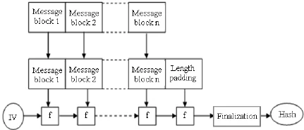
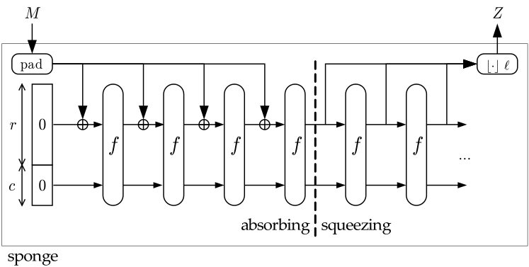

# Cryptographic Hash Functions

## What it is & The Problem it Solves

A **cryptographic hash function** is a deterministic mathematical algorithm that maps data of arbitrary size (a message) to a bit string of fixed size (a digest or hash). It acts as a digital fingerprint of the input data.

While encryption protects **confidentiality** by hiding the contents of a message from unauthorized parties, hash functions are designed to solve fundamentally different security problems:

1. **Proof of Integrity Without Secrecy:** When downloading a software package or document over a public network, we need to verify that the file has not been corrupted in transit or modified by an attacker. Encryption is useless here because the file is meant to be public. Instead, the author publishes the file's hash digest. When you download the file, you compute its hash locally; if your digest matches the published digest, the file is guaranteed to be authentic and untampered with.
2. **Secret Verification Without Storage (Zero Knowledge Storage):** Storing user passwords as plaintext in a database creates a catastrophic single point of failure—if the database is compromised, every user's account is breached. Even encrypting passwords with a secret key is risky, as stealing the decryption key exposes all passwords. Hash functions allow systems to store only the *digest* of each password. When a user logs in, the system hashes their input and compares it to the stored digest. Even database administrators with full read access cannot reverse the hash to recover the plaintext password.

---

## Core Security Properties & Formal Definitions

For a hash function $H: \{0, 1\}^* \to \{0, 1\}^n$ producing an $n$-bit digest to be cryptographically secure, it must satisfy three fundamental properties:

```
+-----------------------------------------------------------------------------------+
| 1. Pre-image Resistance (One-Wayness)                                             |
|    Given: Output Y                                                                |
|    Task:  Find X such that H(X) = Y                                               |
|    Difficulty: Infeasible (Requires ~ 2^n operations)                             |
+-----------------------------------------------------------------------------------+
| 2. Second Pre-image Resistance (Weak Collision Resistance)                        |
|    Given: Input X1 and its output H(X1)                                           |
|    Task:  Find X2 != X1 such that H(X2) = H(X1)                                   |
|    Difficulty: Infeasible (Requires ~ 2^n operations)                             |
+-----------------------------------------------------------------------------------+
| 3. Collision Resistance (Strong Collision Resistance)                             |
|    Given: Nothing (Attacker freely chooses both inputs)                           |
|    Task:  Find ANY pair X1 != X2 such that H(X1) = H(X2)                          |
|    Difficulty: Infeasible (Requires ~ 2^(n/2) operations via Birthday Bound)      |
+-----------------------------------------------------------------------------------+
```

### 1. Pre-image Resistance (One-Wayness)
Given a randomly chosen hash value $Y$ from the output space, it is computationally infeasible to find any input message $X$ such that:

$$H(X) = Y$$

This guarantees that a hash function is **one-way**. If an attacker steals a database of password hashes, pre-image resistance ensures they cannot invert the mathematical transformation to recover the plaintext passwords.

### 2. Second Pre-image Resistance (Weak Collision Resistance)
Given a specific, fixed input message $X_1$, it is computationally infeasible to find a *different* message $X_2 \neq X_1$ such that both produce the exact same hash:

$$H(X_1) = H(X_2)$$

Here, the attacker does **not** get to choose $X_1$; they must find a colliding partner for an existing message. This property prevents an attacker from substituting a malicious document (e.g., a fraudulent wire transfer) in place of a legitimate document after the sender has already signed or verified its hash.

### 3. Collision Resistance (Strong Collision Resistance)
It is computationally infeasible to find **any two distinct messages** $X_1 \neq X_2$ in the entire input space that hash to the same output:

$$X_1 \neq X_2 \implies H(X_1) \neq H(X_2) \quad \text{(with overwhelming probability)}$$

Here, the attacker has complete freedom to craft both $X_1$ and $X_2$. 

> [!IMPORTANT]
> **Hierarchy of Hardness:** Collision resistance is a **stronger** condition than second pre-image resistance. If an attacker can break second pre-image resistance for a given $X_1$, they have automatically found a collision $(X_1, X_2)$. Therefore, any hash function that is collision-resistant is inherently second pre-image resistant.

---

## Mathematical Proofs & Security Bounds

### The Pigeonhole Principle & Theoretical Collisions
Because a hash function maps an infinite input space (messages of arbitrary length $\{0,1\}^*$) to a finite output space (digests of fixed length $\{0,1\}^n$), **collisions must exist mathematically**. 

By the **Pigeonhole Principle**, if there are $2^n$ possible hash outputs, hashing $2^n + 1$ distinct messages guarantees that at least two messages will share the exact same digest. Therefore, cryptography does not rely on collisions being *impossible*; it relies on them being **computationally intractable** to find within the lifespan of the universe.

### Proof: The Birthday Bound & Collision Attack Complexity
Why does finding a collision take only $O(2^{n/2})$ attempts while finding a pre-image takes $O(2^n)$ attempts? This massive gap is governed by the **Birthday Paradox**.

Let $N = 2^n$ be the total number of possible distinct hash outputs. Suppose we randomly pick $k$ independent messages and compute their hashes. What is the probability $P(\text{collision})$ that at least two of these $k$ messages produce the exact same hash?

It is easier to first compute the complementary probability, $P(\text{no collision})$—the probability that all $k$ hashes are entirely distinct:

1. The first hash can be any of the $N$ outputs: $\frac{N}{N} = 1$.
2. The second hash must avoid the 1st output: $\left(1 - \frac{1}{N}\right)$.
3. The third hash must avoid the first two outputs: $\left(1 - \frac{2}{N}\right)$.
4. The $k$-th hash must avoid the previous $k-1$ outputs: $\left(1 - \frac{k-1}{N}\right)$.

Multiplying these independent probabilities together gives:

$$P(\text{no collision}) = \prod_{i=0}^{k-1} \left(1 - \frac{i}{N}\right)$$

Using the standard Taylor series expansion approximation $e^{-x} \approx 1 - x$ (for small $x$), we can substitute $\left(1 - \frac{i}{N}\right) \approx e^{-i/N}$:

$$P(\text{no collision}) \approx \prod_{i=0}^{k-1} e^{-i/N} = \exp\left(-\frac{1}{N} \sum_{i=0}^{k-1} i\right)$$

The sum of the first $k-1$ integers is $\sum_{i=0}^{k-1} i = \frac{k(k-1)}{2} \approx \frac{k^2}{2}$. Substituting this back into the exponent:

$$P(\text{no collision}) \approx e^{-k^2 / (2N)}$$

Therefore, the probability of finding **at least one collision** among $k$ random attempts is:

$$\boxed{P(\text{collision}) = 1 - e^{-k^2 / (2N)}}$$

#### Deriving the Work Factor $k$
To find how many attempts $k$ are required to have a **50% chance of a collision** ($P(\text{collision}) = 0.5$):

$$0.5 = 1 - e^{-k^2 / (2N)} \implies e^{-k^2 / (2N)} = 0.5$$

Taking the natural logarithm of both sides:

$$-\frac{k^2}{2N} = \ln(0.5) = -\ln(2)$$

$$k^2 = 2N \ln(2) \implies k = \sqrt{2 \ln(2) N} \approx 1.177 \sqrt{N}$$

Since $N = 2^n$, substituting $N$ into the square root gives:

$$k \approx 1.177 \times \sqrt{2^n} = 1.177 \times 2^{n/2} = O(2^{n/2})$$

> [!WARNING]
> **The Square Root Effect:** The Birthday Bound proves that an attacker trying to find *any* collision does not need to search $2^n$ times. Because they are comparing every new hash against *all previously generated hashes* (a quadratic number of pairs $\approx k^2/2$), the required number of attempts is proportional to the **square root** of the output space: $2^{n/2}$.

### Why 256 Bits?
In modern cryptography, the baseline security standard is **128-bit security**, meaning an attacker must perform at least $2^{128}$ elementary operations to break the system.

- To achieve **128-bit pre-image resistance**, a digest needs $n = 128$ bits (since breaking pre-image takes $2^n$ work).
- To achieve **128-bit collision resistance**, a digest needs $n = 256$ bits (since breaking collision resistance takes $2^{n/2} = 2^{256/2} = 2^{128}$ work).

This is why **SHA-256** is the industry standard: its 256-bit output size is specifically chosen to guarantee 128 bits of security against birthday attacks. If developers truncate a 256-bit hash down to 128 bits to save database space or network bandwidth, the collision resistance drops exponentially to a trivial $2^{64}$ operations—a workload easily broken by modern GPU clusters in hours.

---

## Low-Entropy Inputs & Brute-Force Limitations

A common misconception is that because a hash function is mathematically one-way, hashing any secret data makes it permanently secure. This is only true if the input data has **high entropy** (unpredictability).

### The Dictionary Attack on PINs and Passwords
Suppose a system stores the SHA-256 hash of a user's 4-digit PIN or a simple English password (e.g., `apple123`). While SHA-256 itself is perfectly pre-image resistant—meaning you cannot algebraically invert the equation $Y = \text{SHA-256}(X)$—an attacker does not need to invert the math.

Because the input space is small (there are only 10,000 possible 4-digit PINs), an attacker can simply compute the SHA-256 hash of every number from `0000` to `9999` in less than a millisecond:

```
Hash("0000") -> 4a7d... != Target
Hash("0001") -> 8a2f... != Target
...
Hash("4829") -> e3b0... == Target (MATCH FOUND!)
```

This is known as a **dictionary attack** or **brute-force enumeration**. 

---

## Password Hashing & Key Derivation Functions (KDFs)

While general cryptographic hash functions (like SHA-256) are designed for maximum speed to verify gigabytes of data quickly, this speed is a catastrophic vulnerability when hashing user passwords. A modern GPU cluster can compute billions of SHA-256 hashes per second, allowing attackers to crack password databases rapidly using dictionary attacks or pre-computed **Rainbow Tables**.

To securely store passwords, cryptography uses specialized **Key Derivation Functions (KDFs)** and password hashing algorithms built on two core principles:

1. **Salting:** A **salt** is a random, unique string generated for each user and appended to the password before hashing: $\text{Hash}(\text{Salt} \mathbin{\|} \text{Password})$. Salting ensures that identical passwords yield entirely different hash outputs in the database, rendering pre-computed Rainbow Tables completely useless.
2. **Tunable Hardness (Work Factors):** Password hash functions intentionally make the hashing process computational- or memory-intensive. While taking 100 milliseconds to verify a password during login is unnoticeable to a user, it slows down an attacker's brute-force speed from billions of guesses per second to just a few dozen per second.

### Standard Password Hashing Algorithms
- **PBKDF2 (Password-Based Key Derivation Function 2):** Applies a standard hash function (like HMAC-SHA256) repeatedly over thousands of iterations (e.g., 100,000+ rounds). While effective against CPU brute-forcing, it is vulnerable to hardware acceleration using GPUs or ASICs.
- **bcrypt:** Based on the Blowfish cipher; introduced tunable CPU hardness and memory requirements that make it significantly more resistant to GPU and ASIC cracking than PBKDF2.
- **Argon2:** The winner of the 2015 Password Hashing Competition and modern industry standard. It is **memory-hard** (requiring gigabytes of RAM to compute a single hash), making parallel GPU or ASIC cracking rigs economically infeasible to build. It allows independently tuning three parameters: execution time (CPU cost), memory required (RAM cost), and degree of parallelism (threads).

---

## Iterative Construction: The Merkle-Damgård Construction

Designing a single mathematical function that directly accepts an arbitrary-length byte stream and produces a secure fixed-size hash is incredibly difficult. Instead, early hash functions (MD5, SHA-1, SHA-256, SHA-512) rely on a modular design principle called the **Merkle-Damgård Construction** (invented independently by Ralph Merkle and Ivan Damgård in 1979).

### How It Works
The construction divides the problem into two parts:
1. A **Compression Function** $f: \{0,1\}^c \times \{0,1\}^b \to \{0,1\}^c$ that takes a fixed-size internal chaining state ($c$ bits) and a fixed-size message block ($b$ bits), compressing them into a new internal state of $c$ bits.
2. An **Iterative Engine** that repeatedly applies $f$ across sequential blocks of a padded message.



#### Step 1: Padding & Merkle-Damgård Strengthening
Because the message must be processed in exact $b$-bit blocks (e.g., 512 bits for SHA-256), the input must be padded:
1. Append a single `1` bit (`0x80` in byte form) to the end of the raw message.
2. Append as many `0` bits as needed until the length of the message is congruent to $(b - (Size of length field))$ modulo $b$.
3. Append a integer representing the **exact bit-length of the original unpadded message** at the very end.

Appending the original message length is called **Merkle-Damgård Strengthening** (or MD-padding). This step is crucial: without it, messages that differ only by trailing zeros would produce identical padded blocks and collide trivially.

#### Step 2: Chaining & Iteration
1. Initialize an internal chaining variable $H_0$ with a fixed, standardized constant called the **Initialization Vector (IV)**.
2. For each message block $M_i$ from $i = 1$ to $n$:
   $$H_i = f(H_{i-1}, M_i)$$
3. The final state $H_n$ (sometimes passed through a finalization transformation) is output as the hash digest.

---

### Security Proof: The Merkle-Damgård Reduction Theorem

Why is this construction so powerful? Because it provides a rigorous mathematical guarantee: **If the underlying fixed-size compression function $f$ is collision-resistant, then the arbitrary-length Merkle-Damgård hash function $H$ is guaranteed to be collision-resistant.**

#### Proof by Contradiction (Reduction)
Assume an adversary successfully finds a collision in the overall hash function $H$. That is, they find two distinct messages $M \neq M'$ such that:

$$H(M) = H(M')$$

We want to prove that this adversary can be used as a subroutine to find a collision in the underlying compression function $f$. Let the padded block representations of the messages be $M = (M_1, M_2, \ldots, M_k)$ and $M' = (M'_1, M'_2, \ldots, M'_l)$.

There are two cases to analyze:

**Case 1: The messages have different lengths ($\text{len}(M) \neq \text{len}(M')$)**
Because of Merkle-Damgård strengthening, the final block of every padded message encodes its original bit-length. Since the lengths differ, their final blocks must be distinct:

$$M_k \neq M'_l$$

However, because the final hash outputs collided, we know the output of the last compression step was identical:

$$f(H_{k-1}, M_k) = f(H'_{l-1}, M'_l)$$

Because the inputs to $f$ on the left side $(H_{k-1}, M_k)$ are distinct from the inputs on the right side $(H'_{l-1}, M'_l)$ (since $M_k \neq M'_l$), **we have immediately found a collision in the compression function $f$**.

**Case 2: The messages have the exact same length ($\text{len}(M) = \text{len}(M') \implies k = l$)**
Since the final hash outputs collided, we look at the last compression step at block $i = k$:

$$f(H_{k-1}, M_k) = f(H'_{k-1}, M'_k)$$

If $(H_{k-1}, M_k) \neq (H'_{k-1}, M'_k)$, we have found a collision in $f$. 
If they *are* equal, it means both the chaining states $H_{k-1} = H'_{k-1}$ and the message blocks $M_k = M'_k$ were identical. We then step backward to block $i = k-1$ and examine the previous compression step:

$$f(H_{k-2}, M_{k-1}) = f(H'_{k-2}, M'_{k-1})$$

We repeat this backward tracing. Because we assumed at the start that the original messages were distinct ($M \neq M'$), there *must* exist some step $j$ (where $1 \le j \le k$) where the inputs to the compression function were different:

$$(H_{j-1}, M_j) \neq (H'_{j-1}, M'_j)$$

Yet, their outputs under $f$ were identical ($H_j = H'_j$). **This again yields a direct collision in the compression function $f$.**

$$\boxed{\text{Collision in } H(M) \implies \text{Collision in } f(H, M)}$$

This reduction proves that no structural weakness in the iterative chaining can cause a collision; breaking the hash function requires breaking the mathematics of the compression function itself.

---

## Merkle-Damgård Families & Their Compression Functions

While the Merkle-Damgård iterative framework is identical across early standard hash functions, the internal **compression function $f$** evolved significantly to defend against cryptanalysis. Most standard compression functions are built using a **Davies-Meyer** structure ($f(H_{i-1}, M_i) = E_{M_i}(H_{i-1}) + H_{i-1}$), which turns a block cipher $E$ into a compression function by encrypting the previous state using the message block as the key.

- **The MD Family (MD4, MD5):** Uses a 4-round (Each containing 16 steps) ARX (Add-Rotate-XOR) network processing 512-bit message blocks; it is completely broken due to differential cryptanalysis vulnerabilities in its simple boolean mixing functions.
- **The SHA-1 Family:** Expands 512-bit message blocks into an 80-word message schedule ($W$-array) to increase diffusion across its 80 rounds; however, differential collision attacks (such as *SHAttered*) have rendered it insecure for digital signatures.
- **The SHA-2 Family (SHA-256, SHA-512):** Retains the Merkle-Damgård architecture but introduces complex orthogonal sigma functions ($\Sigma, \sigma$) and non-linear bitwise majority/choice operations across 64 to 80 rounds, making it highly secure against all known collision and pre-image attacks.

---

## The Sponge Construction (SHA-3 / Keccak)

Following the cryptanalysis of MD5 and SHA-1, NIST initiated the SHA-3 competition to select a backup hash standard with a fundamentally different architecture from Merkle-Damgård. In 2012, **Keccak** won the competition, introducing the **Sponge Construction**.

### How It Works
Instead of a compression function with fixed output sizes, a sponge uses an unkeyed **fixed-length permutation function** $f$ operating on a wide internal state of $b$ bits (for SHA-3 / Keccak, $b = 1600$ bits).

The state is partitioned into two components:
1. **Bitrate ($r$):** The public portion of the state that directly interacts with input and output data. This determines the *speed* of the algorithm.
2. **Capacity ($c$):** The hidden portion of the state that is never directly touched by input or output. This determines the *security level* against attacks ($\text{Capacity } c = 2 \times \text{Security Level}$, If output length is large enough) .



### The Two Phases of a Sponge
1. **Absorbing Phase (Input):** The message is split into $r$-bit blocks. Each block is XOR'd into the bitrate ($r$) of the state, followed by applying the permutation function $f$ across the entire 1600-bit state. This repeats until all message blocks are absorbed.
2. **Squeezing Phase (Output):** Output bits are read directly from the bitrate ($r$) of the state. If the required hash digest is longer than $r$ bits, the permutation $f$ is applied again, and another $r$ bits are squeezed out.

> [!IMPORTANT]
> **Why Sponge is Superior to Merkle-Damgård:** Because the capacity $c$ is never directly exposed during absorbing or squeezing, an attacker cannot observe or manipulate the full internal state. This makes the Sponge Construction **completely immune to Length Extension Attacks** by design!

---

### Extendable-Output Functions (XOFs): SHAKE and cSHAKE

Because the squeezing phase of a sponge can produce an infinite stream of pseudorandom bits, NIST standardized a new class of cryptographic primitives: **Extendable-Output Functions (XOFs)**. Unlike traditional hash functions that output a fixed number of bits (like 256 bits), an XOF allows the application to request **any arbitrary output length $d$**.

#### 1. SHAKE (SHAKE128 & SHAKE256)
SHAKE stands for *Secure Hash Algorithm Keccak Extendable-output*. It uses the exact same Keccak permutation as SHA-3, but allows generating variable-length outputs:
- **SHAKE128:** Provides **128-bit security** against collision and pre-image attacks, regardless of the requested output length $d$ (provided $d \ge 256$ bits for collision resistance).
- **SHAKE256:** Provides **256-bit security** (using a larger internal capacity $c = 512$ bits).

**Key Use Cases:** Generating keystreams for stream ciphers, deriving cryptographic keys of varying lengths from a master secret, and generating custom-length identifiers or nonces without needing a separate Key Derivation Function (KDF).

#### 2. cSHAKE (Customizable SHAKE)
Standardized in NIST SP 800-185, **cSHAKE** extends SHAKE by allowing developers to pass an arbitrary **Customization String** ($S$)—a simple label like `"EmailSignature"`, `"SessionKey"`, or `"DatabaseIndex"`.

$$\text{cSHAKE256}(M, d, S)$$

**Why cSHAKE is Revolutionary:**
Even if you hash the exact same message $M$, using different customization strings produces completely different, statistically independent hash outputs:

```
cSHAKE256(M="Alice", d=256, S="EmailSign") -> 0a8f3b... (Domain A)
cSHAKE256(M="Alice", d=256, S="AuthToken") -> 9d2c71... (Domain B - Totally Independent!)
```

This eliminates **domain collision bugs** across different features or protocols in software systems. You no longer need to manually prepend ad-hoc prefixes like `Hash("email:" + M)` or use HMAC just to prevent replay attacks between different parts of an application.

---

## Standard Hash Algorithms & Evolution

| Family / Algorithm | Construction | Output Size | Block / Rate Size | Current Security Status |
| :--- | :--- | :--- | :--- | :--- |
| **MD5** | Merkle-Damgård (ARX) | 128 bits | 512 bits | **Broken** (Trivial collisions via flame/chosen-prefix attacks; easily cracked on consumer CPUs). |
| **SHA-1** | Merkle-Damgård (W-array) | 160 bits | 512 bits | **Broken** (Collisions demonstrated in practice via *SHAttered* attack in 2017; deprecated). |
| **SHA-256** | Merkle-Damgård ($\Sigma / \sigma$) | 256 bits | 512 bits | **Secure** (Industry standard for SSL/TLS, certificates, file integrity, and Bitcoin). |
| **SHA-512** | Merkle-Damgård ($\Sigma / \sigma$) | 512 bits | 1024 bits | **Secure** (High-performance variant on 64-bit architectures; 256-bit collision bound). |
| **SHA-3 (Keccak)** | **Sponge Construction** | 224–512 bits | Variable ($r$) | **Secure** (Selected by NIST in 2012; immune to length extension attacks). |
| **SHAKE / cSHAKE**| **Sponge (XOF)** | **Arbitrary ($d$)**| 1088–1344 bits | **Secure** (Standardized XOFs with built-in domain separation and customization). |

---

## Connected to
- [Modes of Operation (ECB, CBC, CTR)](../block-cipher/modes-of-operation.md)
- [XOR and Why It Is Used](../xor-and-why-it-is-used.md)

